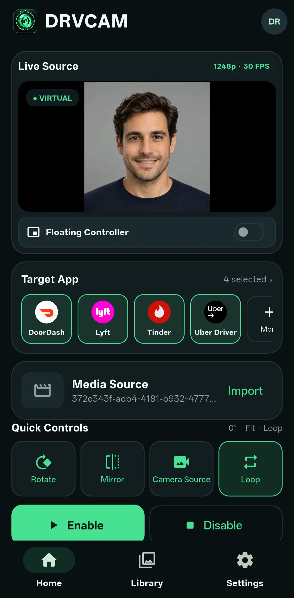
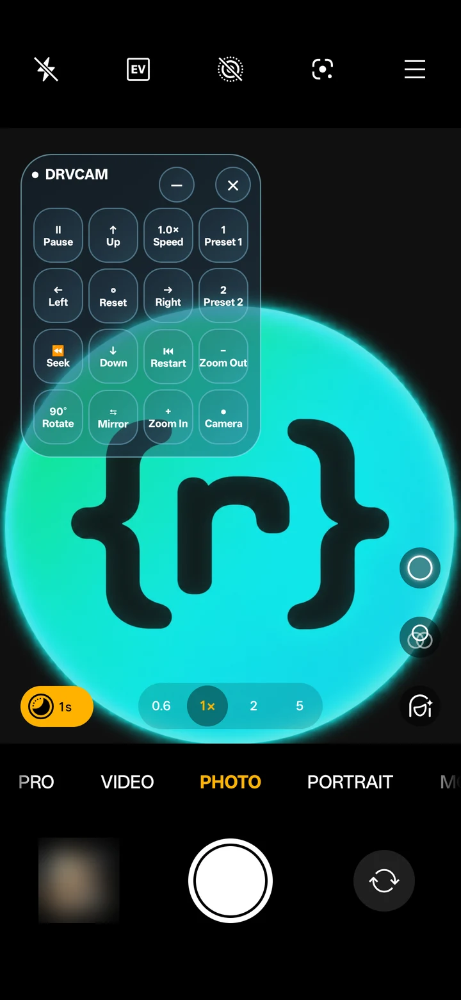
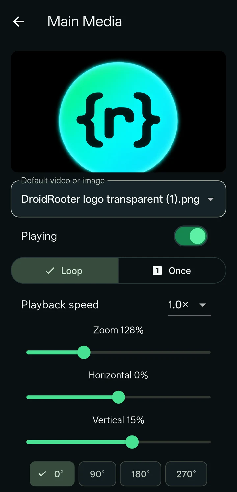
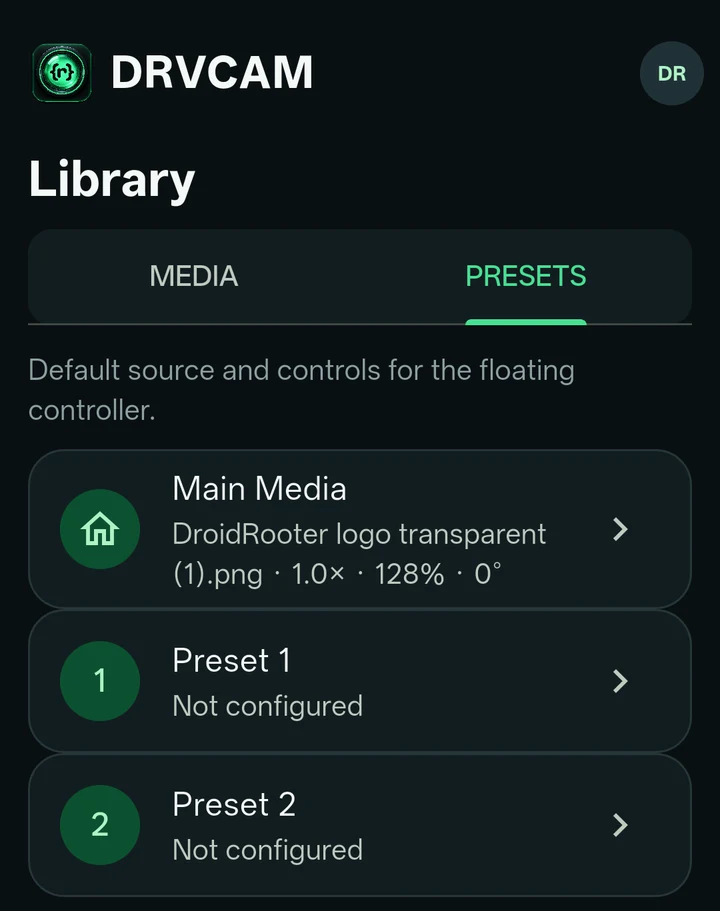

# DRVCAM

[English](README.md) | **Español** | [العربية](README.ar.md) | [Deutsch](README.de.md) | [Français](README.fr.md) | [Italiano](README.it.md) | [日本語](README.ja.md) | [简体中文](README.zh-hans.md)

**Una cámara virtual para dispositivos Android compatibles con root.** Elige una foto o un vídeo y preséntalo como la señal de cámara de las apps que elijas, con reproducción en directo y controles de encuadre.

> **Versión alpha.** DRVCAM está en desarrollo activo y el comportamiento puede variar según el dispositivo.

Este repositorio aloja únicamente **las descargas de DRVCAM** — sin código fuente. Página del producto, precios y documentación completa: **[droidrooter.com/drvcam](https://www.droidrooter.com/drvcam/)**.

## Índice

- [Capturas de pantalla](#capturas-de-pantalla)
- [Qué hace](#qué-hace)
- [Requisitos](#requisitos)
- [Descargar](#descargar)
- [Instalar](#instalar)
- [Plan gratuito y planes de pago](#plan-gratuito-y-planes-de-pago)
- [Aspectos básicos de privacidad](#aspectos-básicos-de-privacidad)
- [Preguntas frecuentes](#preguntas-frecuentes)
- [Aviso legal](#aviso-legal)
- [Licencia](#licencia)
- [Soporte](#soporte)
- [Registro de cambios](#registro-de-cambios)

## Capturas de pantalla

| Inicio | Controlador flotante |
|---|---|
|  |  |

| Editor de medios | Presets |
|---|---|
|  |  |

## Qué hace

- Usa una foto o un vídeo que importas como fuente de cámara de una app que elijas, donde el dispositivo, la API de cámara y la app lo permitan.
- Te deja elegir las apps de destino y ajustar reproducción, rotación, reflejo, zoom y encuadre. Puedes guardar y cambiar entre una fuente Main y dos presets.
- Te deja alternar un destino configurado entre la señal virtual y la cámara física real. Algunas apps necesitan que se reabra su cámara antes de que el cambio se note; DRVCAM te avisa cuando es el caso.
- Ofrece un controlador flotante opcional que permanece sobre la app que utilizas (necesita el permiso de superposición).
- No modifica el micrófono real — DRVCAM no sustituye ni procesa el audio.

## Requisitos

- Un dispositivo Android con root (Magisk o KernelSU), Android 9 o posterior. La sustitución de cámara necesita root; sin él, la app se abre pero la sustitución no está disponible.
- Un framework de la familia Xposed compatible con libxposed API 102 — DRVCAM se prueba con [Vector](https://github.com/JingMatrix/Vector) (el sucesor de LSPosed), un framework de la familia LSPosed basado en Zygisk. Un framework sin soporte de API 102 no cargará el módulo.
- Suficiente capacidad de decodificación y gráficos para el contenido y la app que elijas.

## Descargar

| Compilación | Android | Destino |
|---|---|---|
| `DRVCAM-modern-phone.apk` | 12 a 17 | Teléfono/tableta, arm64 |
| `DRVCAM-legacy-phone.apk` | 9 a 11 | Teléfono/tableta, arm64 |
| `DRVCAM-modern-emulator.apk` | 12 a 17 | Emulador, x86_64 |
| `DRVCAM-legacy-emulator.apk` | 9 a 11 | Emulador, x86_64 |

Descarga la compilación que corresponde a tu dispositivo desde la **[última versión](https://github.com/saadnahid7/drvcam-releases/releases/latest)**. Cada versión incluye un `SHA256SUMS.txt`: verifica tu descarga antes de instalar. Las mismas compilaciones y un selector interactivo también están en la [página del producto](https://www.droidrooter.com/drvcam/).

## Instalar

1. Descarga e instala el APK que corresponde a tu versión de Android y tipo de dispositivo (arriba).
2. Abre el gestor de tu framework y activa DRVCAM; reinicia si te lo pide.
3. Abre DRVCAM y concede root cuando se te solicite. DRVCAM gestiona el alcance de las apps que elijas desde dentro de su propia app — no hace falta añadir nada a mano en el gestor del framework.
4. Inicia sesión, o elige **Probar gratis** (consulta [Plan gratuito y planes de pago](#plan-gratuito-y-planes-de-pago)).
5. Importa una foto o un vídeo a Biblioteca, selecciónalo, elige una app de destino y pulsa **Enable**. Abre tú mismo la cámara de la app de destino.
6. Comprueba el resultado dentro de la app de destino. La vista previa de DRVCAM te ayuda a elegir el contenido; por sí sola no demuestra que la app de destino haya recibido la señal.

**Disable** elimina de nuevo el alcance de DRVCAM sobre el destino.

## Plan gratuito y planes de pago

DRVCAM necesita una cuenta de DRVCAM y conexión a internet para iniciar sesión, registrar el dispositivo y renovar el acceso. Tras iniciar sesión, la app puede seguir funcionando sin conexión durante un periodo limitado.

- **Probar gratis** (sin coste): fuentes de imagen, una app de destino.
- **Planes de pago**: fuentes de vídeo, varias apps de destino, el controlador flotante y el cambio de Camera Source.

Planes, límites de dispositivos y precios actuales: **[droidrooter.com/drvcam](https://www.droidrooter.com/drvcam/#pricing)**.

## Aspectos básicos de privacidad

- Tu contenido permanece en tu dispositivo durante el funcionamiento de la cámara — el servicio de cuentas no necesita tu contenido ni los fotogramas de la cámara para iniciar tu sesión.
- El servicio de cuentas procesa datos de cuenta, dispositivo y suscripción para que el inicio de sesión y la licencia funcionen. Los diagnósticos solo se envían si los solicitas.
- Una app de destino puede seguir guardando, analizando o transmitiendo lo que muestra su cámara; se aplican las prácticas de privacidad propias de esa app.
- Política completa: [droidrooter.com/privacy](https://www.droidrooter.com/privacy).

## Preguntas frecuentes

**¿Necesita root?**
Sí. La sustitución de cámara se entrega mediante un hook a nivel de sistema que requiere root y un framework compatible de la familia Xposed.

**¿Funcionará en mi dispositivo?**
Solo las combinaciones verificadas aparecen en la página del producto. El dispositivo, el firmware y la app de cámara varían demasiado para prometer compatibilidad de antemano.

**¿Puedo usarlo sin iniciar sesión?**
Sí, con **Probar gratis** (fuentes de imagen, una app de destino). El vídeo y las demás funciones necesitan un plan de pago.

**He perdido mi contraseña, ¿qué hago?**
La recuperación de cuenta es manual por ahora; usa los enlaces de [Soporte](#soporte) de abajo.

**¿Dónde está el código fuente?**
No se publica aquí. Este repositorio distribuye únicamente binarios de versión firmados.

## Aviso legal

DRVCAM es software alpha, proporcionado "tal cual" sin garantía de ningún tipo. Rootear un dispositivo e instalar un framework sin sistema son acciones que realizas bajo tu propia responsabilidad y pueden afectar a la garantía o estabilidad de tu dispositivo.

Eres el único responsable del contenido que utilices, de las aplicaciones con las que uses DRVCAM y de cumplir las leyes y los términos que te sean aplicables. El desarrollador no se responsabiliza de ningún uso ilegal, no autorizado o indebido de este software.

## Licencia

DRVCAM es software propietario y de código cerrado. No se concede ninguna licencia para copiar, modificar, aplicar ingeniería inversa o redistribuir la aplicación. La descarga e instalación se rigen por los [Términos de uso](https://www.droidrooter.com/terms) publicados en el sitio del producto.

## Soporte

- Telegram: [@DroidRooter](https://t.me/DroidRooter)
- Formulario de contacto del sitio: [droidrooter.com/contact](https://www.droidrooter.com/contact)

## Registro de cambios

Consulta las notas de cada [versión de GitHub](https://github.com/saadnahid7/drvcam-releases/releases) para ver los cambios.
